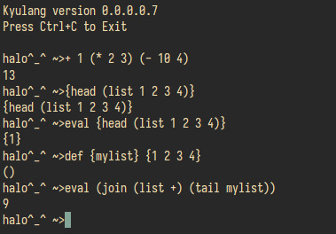

# Kyulang
Kyulang is the kyu-test lisp dialect known to man! This dialect is not for production use but more of a fun project made to satisfy my urges. Feel free to test it to experience maximal cuteness.

## Showcase


## How to
```
  git pull https://github.com/bhawandeeps/kyulang.git
  cd kyulang
  gcc -Wall -Wextra -std=c11 kyulang.c mpc.c -o build/kyulang -ledit -lm 
  ./build/kyulang
```

## Credits
 - Made as described in buildyourownlisp.com
 - [MPC](https://github.com/orangeduck/mpc)
